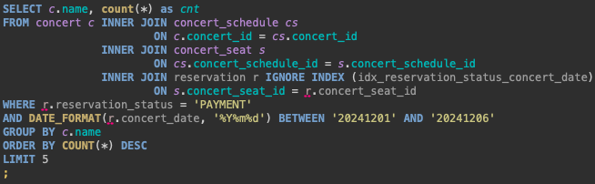
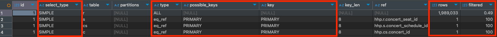
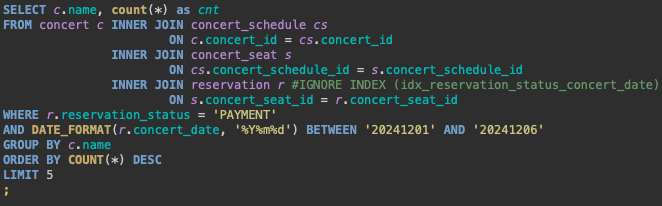
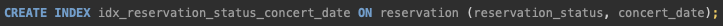
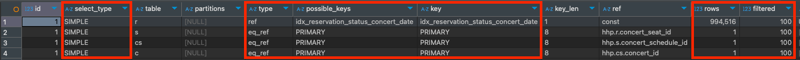

# 인덱스 설정해 보기

## 0. 사전 조사

### 1) mysql 설치

- Local에 mysql 설치
  - 장점
    - 간편하다
    => `채택`
- Docker 위에 mysql 설치
  - 장점
    - 알관된 환경을 제공한다.
    - 확장성이 용이하다.
  - 단점
    - Docker 서버 위에 Docker Container 인스턴스가 생성되는데, 서버 혹은 인스턴스가 종료되면 데이터가 날라간다.
      - 해결방법: Docker Volume 설정을 통해 데이터를 영구적으로 보관할 수 있다.
        - AWS S3, AWS EBS, Google Cloud Storage, ...

### 2) DB 데이터 적재

- DB 데이터 적재 방법
  1. k6 사용
  2. java, python 사용
  3. Procedure 사용

    => 벌크 데이터로 넣기 편한 `Procedure 채택`

### 3) 실행계획 실행 시 확인할 부분
  - select_type
    - 쿼리 조회 유형을 확인할 수 있는 필드.
    - `SIMPLE`, `PRIMARY`, `UNION`, `SUBQUERY`, `DERIVED` 등이 있다.
  - type
    - 각 테이블이 어떻게 효과적으로 조인됐는지 볼 수 있는 지표.
    - 대표적으로 `SYSTEM` -> `CONST` -> `EQ_REF` -> `REF` -> `RANGE` -> `INDEX` -> `ALL` 등이 있다.
        - 우측으로 갈 수록 성능이 안 좋다고 볼 수 있다.
  - possible_keys
    - 쿼리에 사용될 수 있는 인덱스 목록을 보여준다.
    - 인덱스가 있어도 옵티마이저 통계 정보에 따라 사용되지 않을 수 있다.
  - key
    - 쿼리가 실제로 사용한 인덱스
    - null이면 인덱스를 사용하지 않았음을 나타낸다.
    - 사용 가능한 인덱스가 있을 때 `FORCE INDEX` 또는 `USE INDEX` 힌트를 사용해 인덱스를 지정할 수도 있다.
    - 테스트 용으로 인덱스를 강제로 사용하고 싶지 않을 경우 `IGNORE INDEX (idx)` 를 사용할 수도 있다.
  - filtered
    - filtered는 테이블에서 조건에 일치하는 행 비율을 백분율로 표시한다.
    - 최종적으로 조건에 따라 얼마나 많은 행이 필터링되는지를 알려주는 정보.
    - 값이 100에 가까울수록 필터링이 효과적임.

## 1. 테스트 환경

- OS: macOS Sonoma 14.6.1
- CPU: Apple M1, 8-core
- Memory: 8GB LPDDR4X
- Storage: 256GB SSD
- thread pool: 16(8 * 2)

## 2. 테이블 당 레코드 개수

- 콘서트 - 10 건
- 콘서트 일정 - 30 건
- 콘서트 좌석 - 300만 건 (콘서트 일정 * 100000 좌석)
- 예약 - 약 200만 건 (임시예약/결제)

## 3. 테스트 예상 시나리오

- 인기 콘서트 TOP5 조회

## 4. 각 시나리오 별 index 적용 전/후 비교

1. 시나리오
    - index 적용 전
        - 쿼리
          
        - 속도
            - 5 row(s) fetched - 2s
        - 실행계획
            
            - type이 ALL이므로 풀스캔이 되고 있다.
            - 사용할 수 있는 인덱스 없음.
            - 필터링이 0.49로 거의 필터가 되지 않고 있다고 볼 수 있다.
    - index 적용 후
        - 쿼리
          
        - index 적용
      
            
            - 적용 이유
                - 카디널리티가 낮은 컬럼이지만`(reservation_status)`이지만 복합 인덱스로 활용 가치는 있다.
                - `reservation_date` 컬럼에 범위 조건을 사용해야 하므로 인덱스 생성 시 제일 마지막에 배치.
        - 속도
            - 5 row(s) fetched - 1s
        - 실행계획 분석
            
            - type이 ref로 적절한 인덱스를 사용해 값을 찾아냈음을 알 수 있다.
            - `idx_reservation_status_concert_date` 인덱스가 사용되었다.
            - 100% 필터가 되었음을 확인할 수 있다.

## 5. 결과(인덱스 적용 후 깨달은 점)

- 실행결과 2s -> 1s 로 50% 감소
- 카디널리티가 높은 쪽으로 인덱스를 먼저 거는 게 중요하다.
- 그럼에도 불구하고 실제 데이터의 분포에 따라 옵티마이저의 통계가 달라지므로 실제 데이터의 분포를 고려한 인덱스 설계가 필요하다.
- 시간이 지남에 따라 데이터의 분포가 달라진다. → 옵티마이저 통계 정보가 변경된다.
    - 즉, 주기적인 실행계획 점검을 통해 적절한 인덱싱이 필요하다.
- `카디널리티가 낮다 = 유니크한 값이 적다 = 중복도가 높다 = 분포도가 낮다 = 탐색 비용이 커진다`
- `카디널리티가 높다 = 유니크한 값이 많다 = 중복도가 낮다 = 분포도가 높다 = 탐색 비용이 적어진다`