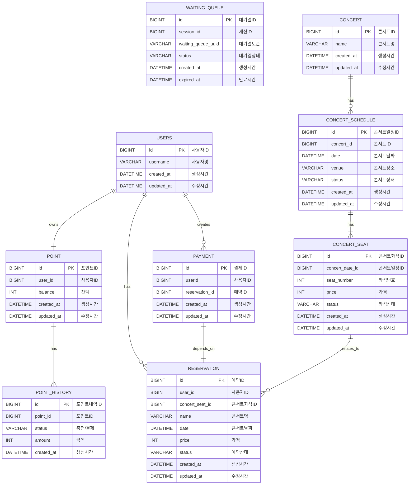

```mermaid

erDiagram
    USERS ||--|| POINT : owns
    USERS ||--o{ RESERVATION : has
    USERS ||--o{ PAYMENT : creates
    USERS {
        BIGINT id PK "사용자ID"
        VARCHAR username "사용자명"
        DATETIME created_at "생성시간"
        DATETIME updated_at "수정시간"
    }

    POINT ||--|{ POINT_HISTORY : has
    POINT {
        BIGINT id PK "포인트ID"
        BIGINT user_id "사용자ID"
        INT balance "잔액"
        DATETIME created_at "생성시간"
        DATETIME updated_at "수정시간"
    }

    POINT_HISTORY {
        BIGINT id PK "포인트내역ID"
        BIGINT point_id "포인트ID"
        VARCHAR status "충전/결제"
        INT amount "금액"
        DATETIME created_at "생성시간"
    }
    
    WAITING_QUEUE {
        BIGINT id PK "대기열ID"
        BIGINT session_id "세션ID"
        VARCHAR waiting_queue_uuid "대기열토큰"
        VARCHAR status "대기열상태"
        DATETIME created_at "생성시간"
        DATETIME expired_at "만료시간"
    }

    CONCERT ||--o{ CONCERT_SCHEDULE : has
    CONCERT {
        BIGINT id PK "콘서트ID"
        VARCHAR name "콘서트명"
        DATETIME created_at "생성시간"
        DATETIME updated_at "수정시간"
    }

    CONCERT_SCHEDULE ||--|{ CONCERT_SEAT : has
    CONCERT_SCHEDULE {
        BIGINT id PK "콘서트일정ID"
        BIGINT concert_id "콘서트ID"
        DATETIME date "콘서트날짜"
        VARCHAR venue "콘서트장소"
        VARCHAR status "콘서트상태"
        DATETIME created_at "생성시간"
        DATETIME updated_at "수정시간"
    }

    CONCERT_SEAT ||--o{ RESERVATION : relates_to
    CONCERT_SEAT {
        BIGINT id PK "콘서트좌석ID"
        BIGINT concert_date_id "콘서트일정ID"
        INT seat_number "좌석번호"
        INT price "가격"
        VARCHAR status "좌석상태"
        DATETIME created_at "생성시간"
        DATETIME updated_at "수정시간"
    }

    PAYMENT ||--|| RESERVATION : depends_on
    PAYMENT {
        BIGINT id PK "결제ID"
        BIGINT userId "사용자ID"
        BIGINT reservation_id "예약ID"
        DATETIME created_at "생성시간"
        DATETIME updated_at "수정시간"
    }
    
    RESERVATION {
        BIGINT id PK "예약ID"
        BIGINT user_id "사용자ID"
        BIGINT concert_seat_id "콘서트좌석ID"
        VARCHAR name "콘서트명"
        DATETIME date "콘서트날짜"
        INT price "가격"
        VARCHAR status "예약상태"
        DATETIME created_at "생성시간"
        DATETIME updated_at "수정시간"
    }
```