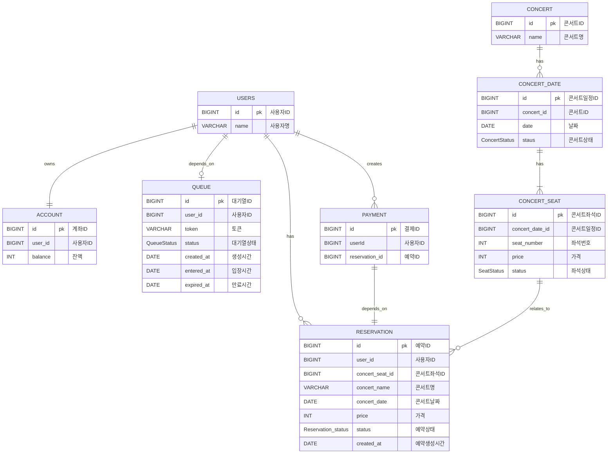

```mermaid

erDiagram
    USERS ||--|| ACCOUNT : owns
    USERS ||--o| QUEUE : depends_on
    USERS ||--o{ RESERVATION : has
    USERS ||--o{ PAYMENT : creates
    USERS {
        BIGINT id pk "사용자ID"
        VARCHAR name "사용자명"
    }

    ACCOUNT {
        BIGINT id pk "계좌ID"
        BIGINT user_id "사용자ID"
        INT balance "잔액"
    }
    
    QUEUE {
        BIGINT id pk "대기열ID"
        BIGINT user_id "사용자ID"
        VARCHAR token "토큰"
        QueueStatus status "대기열상태"
        DATE created_at "생성시간"
        DATE entered_at "입장시간"
        DATE expired_at "만료시간"
    }

    CONCERT ||--o{ CONCERT_DATE : has
    CONCERT {
        BIGINT id pk "콘서트ID"
        VARCHAR name "콘서트명"
    }

    CONCERT_DATE ||--|{ CONCERT_SEAT : has
    CONCERT_DATE {
        BIGINT id pk "콘서트일정ID"
        BIGINT concert_id "콘서트ID"
        DATE date "날짜"
        ConcertStatus staus "콘서트상태"
    }

    CONCERT_SEAT ||--o{ RESERVATION : relates_to
    CONCERT_SEAT {
        BIGINT id pk "콘서트좌석ID"
        BIGINT concert_date_id "콘서트일정ID"
        INT seat_number "좌석번호"
        INT price "가격"
        SeatStatus status "좌석상태"
    }

    PAYMENT ||--|| RESERVATION : depends_on
    PAYMENT {
        BIGINT id pk "결제ID"
        BIGINT userId "사용자ID"
        BIGINT reservation_id "예약ID"
    }
    
    RESERVATION {
        BIGINT id pk "예약ID"
        BIGINT user_id "사용자ID"
        BIGINT concert_seat_id "콘서트좌석ID"
        VARCHAR concert_name "콘서트명"
        DATE concert_date "콘서트날짜"
        INT price "가격"
        Reservation_status status "예약상태"
        DATE created_at "예약생성시간"
    }
```