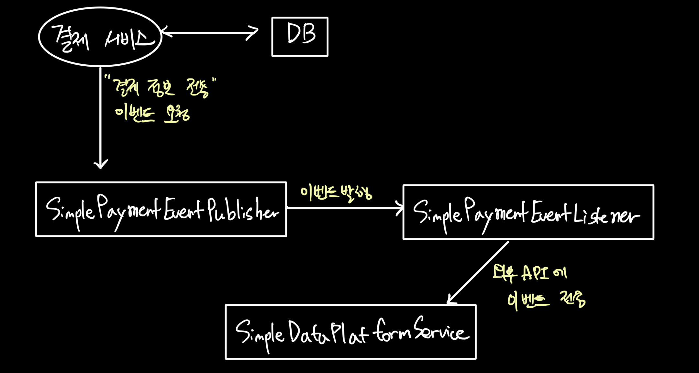

# 이벤트

## 의사결정 흐름

### 1. 메인 로직과 서브 로직 분리 

<b> 가정 : 결제 완료 후 결제 정보 전송을 위한 외부 API 호출 </b>

1. 예약확인
2. 포인트 사용
3. 포인트 내역 저장
4. 결제
5. `결제 정보 전송` -> 서브로직 (분리 대상)

### 2. 서브 로직은 이벤트로 관심사를 분리하자

1. 결제 서비스는 결제 로직에만 집중해야 한다.
   - 결제가 끝난 후 결제 정보 전송의 책임은 이벤트에게 넘기자.
2. 결제 서비스라는 하나의 트랜잭션에 외부 API를 호출하는 로직까지 섞여 있으면,   트랜잭션 범위가 늘어나고, 예외/에러 발생 시 메인 로직까지 영향을 줄 수 있다.
3. 따라서 이벤트 비동기로 처리해 관심사를 분리하고 이벤트 발송이 실패하면 재시도 로직 또는 롤백을 위한 보상 트랜잭션을 만든다.

### 3. 설계

1. 결제 서비스에서 `Publisher`에게 '결제정보전송' 이벤트 요청
2. `Publisher`는 `Listener`에게 이벤트 발행
3. `Listener`는 `DataPlatformService`에게 이벤트 전송
4. `DataPlatformService`가 최종적으로 이벤트 처리 (비동기)