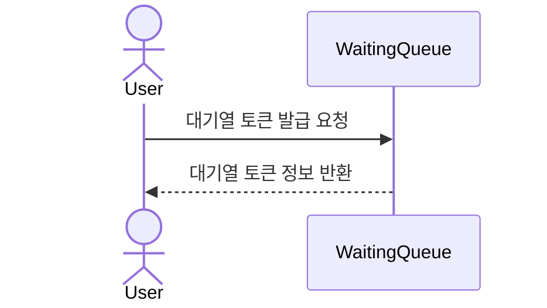
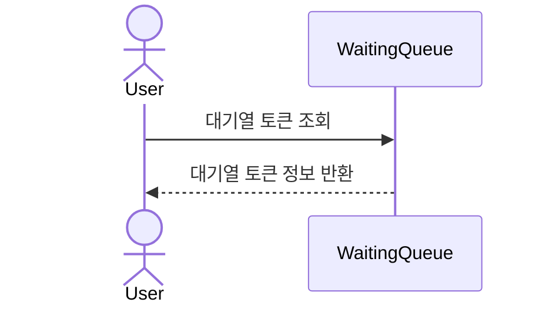
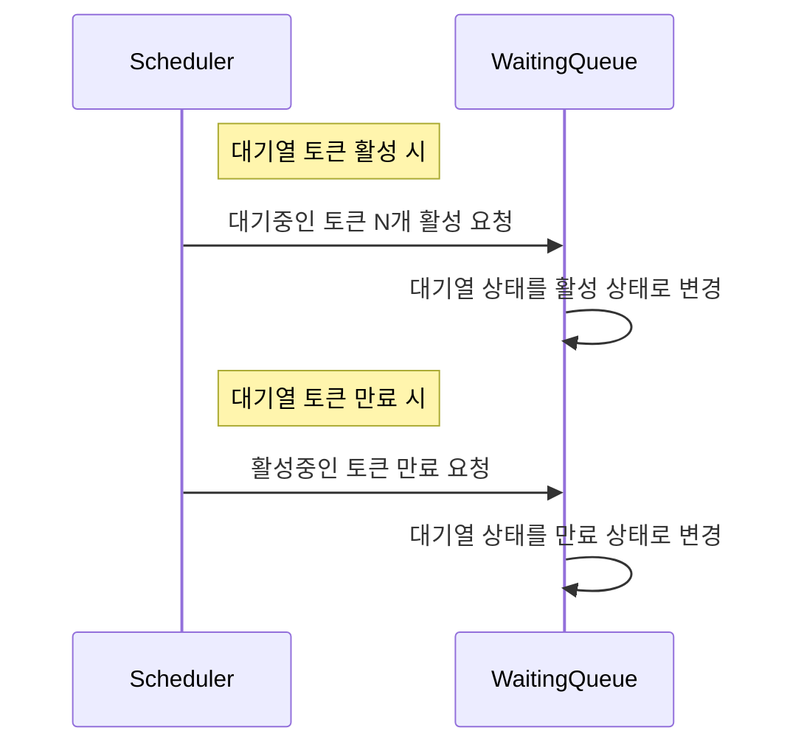
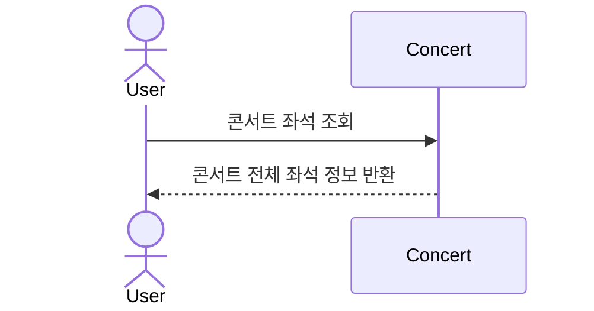
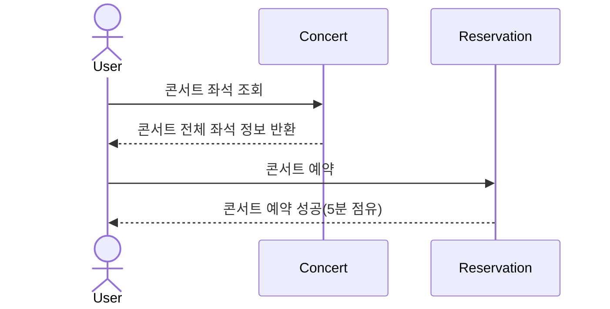
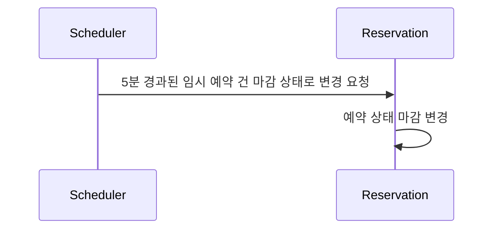
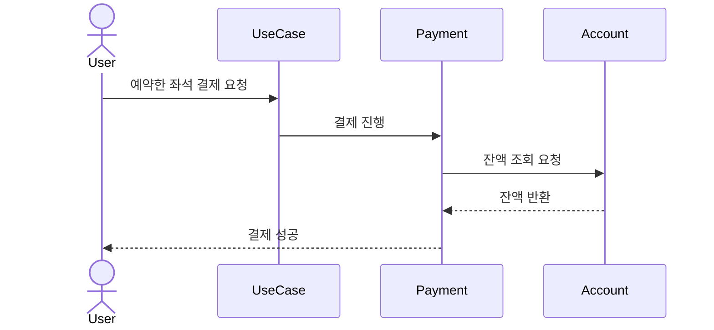
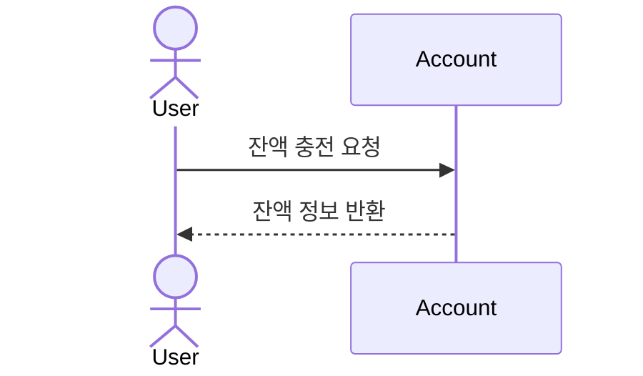
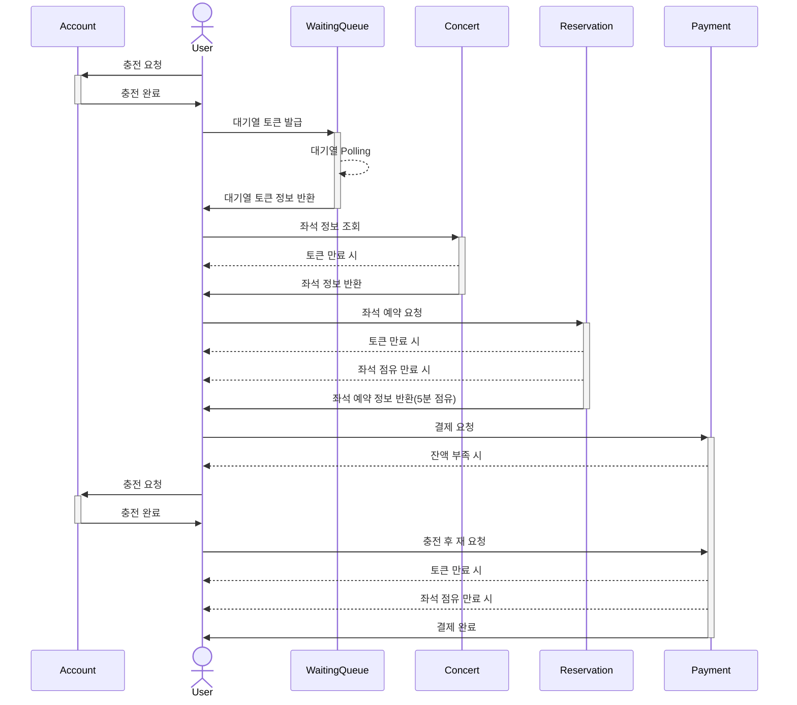

### 2~7의 모든 일련의 과정은 `대기열 검증이 통과(활성 상태)한` 유효한 상태여야 하며, 유효하지 않은 토큰은 이용할 수 없습니다.

---

## 1. 대기열 토큰 발급 요청

### Description
-  사용자가 대기열 토큰 발급을 요청합니다.
-  대기열은 토큰 정보를 반환합니다.

## 2. 대기열 토큰 조회

### Description
-  사용자가 대기열 토큰을 조회합니다.
-  대기열은 토큰 정보를 반환합니다.

## 3. 대기열 활성/만료 체크

### Description
-  대기열 토큰 활성 시
   - M분 간격으로 `대기중인 토큰 N개를 활성 요청`합니다.
   - 대기열 상태를 `활성 상태`로 변경합니다.
-  대기열 토큰 만료 시
   - `만료시간에 도달한` 활성 토큰을 만료 요청합니다.
   - 대기열 상태를 `만료 상태`로 변경합니다.

## 4. 콘서트 좌석 조회

### Description
- 예약 가능한 날짜의 콘서트 정보를 조회합니다.
- 선택한 콘서트의 전체 좌석 정보를 반환합니다.
  - `예약좌석(예약 + 점유중인 예약), 빈 좌석`

## 5. 콘서트 좌석 예약

### Description
- 예약 가능한 콘서트 좌석을 조회 후 선택합니다.
- 예약을 진행합니다.
- 예약에 성공시 5분간 `임시 예약 상태`가 됩니다.
- 만약 5분안에 결제를 하지 않으면 점유한 예약은 회수됩니다.

## 6. 임시 예약 좌석 만료 체크

### Description
- 임시 예약 상태중 예약시간이 5분 경과한 예약 건은 마감 상태로 변경합니다.

## 7. 결제

### Description
- 예약한 좌석에 대해 결제를 요청합니다.
- 결제를 진행합니다.
- 잔액이 부족하지 않으면 결제에 성공합니다.

## 8. 충전 잔액 조회

### Description
- 충전 잔액을 조회합니다.

## 9. 잔액 충전

### Description
- 잔액을 충전합니다.

---
## 10. 전체 시퀀스

